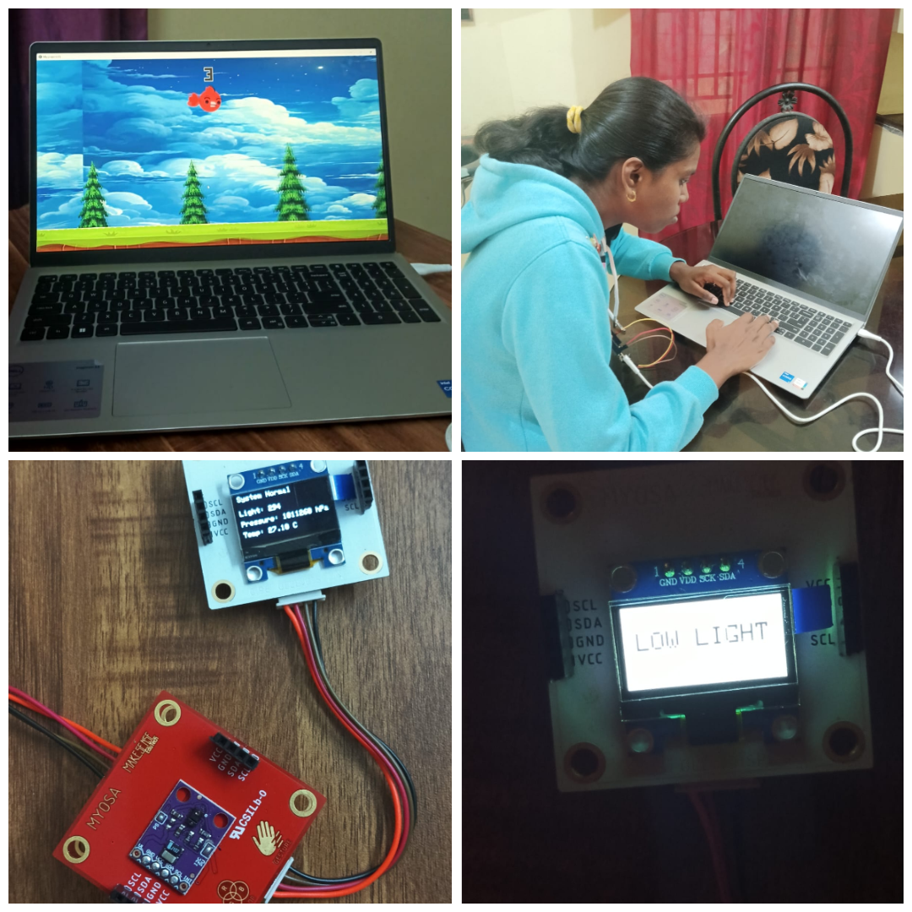
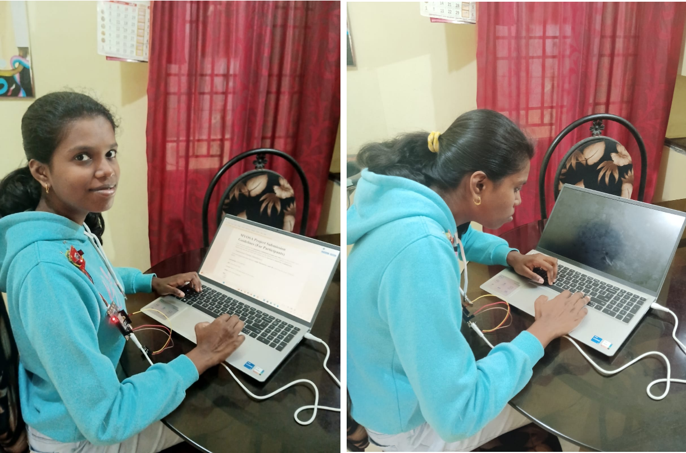
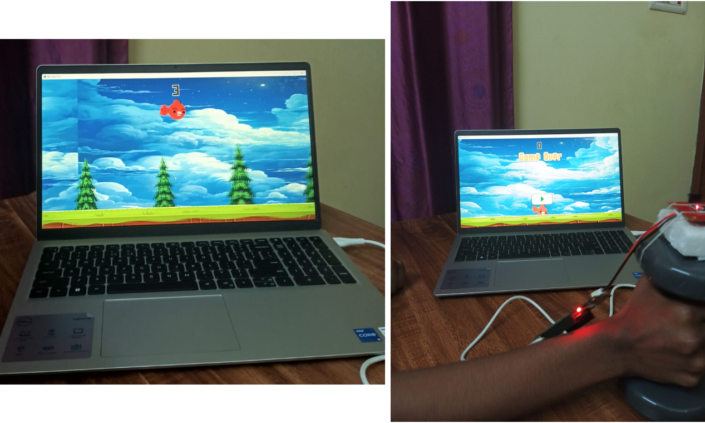
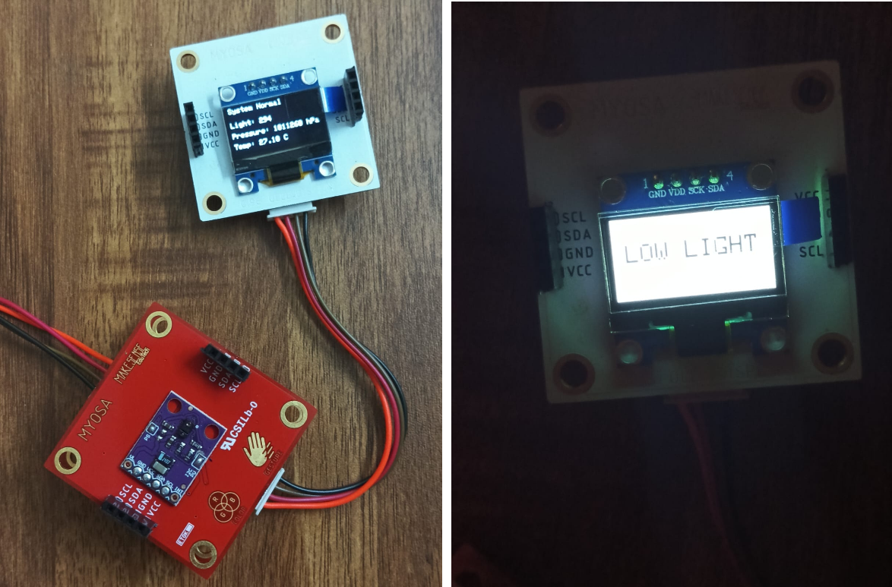

<p align="center">
  <br/>
  <i>cover image</i>
</p>

## MYOSA EBAFS

The **MYOSA Ergonomic Biomechanics and Active Feedback System (EBAFS)** integrates three modules — active posture compliance, gamified exercise, and environmental monitoring — into a unified platform.

## Acknowledgements

We would like to express our sincere gratitude to **MYOSA** and the **IEEE Sensors Council** for providing the essential mini‑kit and technical resources that enabled us to successfully complete the MYOSA EBAFS project. Their support has been invaluable in turning the concept into a working prototype. We are deeply thankful to **Arun Mathiyalagan Sir** for his constant encouragement, and to the **HOD of the ECE Department of Panimalar Engineering College Dr. Rajakumar Sir** for his guidance. Finally, we extend our heartfelt thanks to our **family**, whose motivation and support made this project possible.  
This project would not have been possible without the combined support of these mentors and institutions, whose contributions ensured that MYOSA EBAFS could evolve from an idea into a practical, interactive, and impactful ergonomics system.

## Overview

* **Posture Module:** Enforces active compliance by blacking out the laptop screen and sounding a buzzer when slouching is detected. User needs to sit back straight to be able to resume work.
* **Fitness Module:** Gamifies exercise through a custom developed game where the NemoBird character jumps to avoid tree obstacles when a bicep curl is performed.
* **Environment Module:** Monitors ambient light, pressure, and temperature, issuing warnings via buzzer and OLED display in low-light conditions.

## Features
### 1. Posture Correction 
- An accelerometer sensor is strapped to the user's shoulder and the system calibrates when the user sits with the correct posture.
- If slouching is detected: buzzer sounds and the **laptop screen blacks out**. The user can resume their laptop work only if they return to correct posture.
- Unlike mobile‑notification systems, the user must physically sit back straight for the buzzer to stop and the screen to become normal again.
- Ensures **active compliance** rather than passive reminders.
- Targets **freelancers and laptop users** to help prevent **lumbar spine pain** and **cervicogenic headaches**
<p align="center">
  <br/>
  <i>active posture correction</i>
</p>


https://github.com/user-attachments/assets/66c64479-a4fb-4934-b4fe-21787e479275


### 2. Fitness Game Integration 
- A **custom game** was built in Unityhub.
- Accelerometer attached to a **dumbbell** detects bicep curls (0° → 90°).
- When the user **performs one full lift** and the threshold is reached, the **NemoBird character jumps to avoid tree obstacles**.
- Next jump is not initiated unless user moves dumbell to resting position to **prevent false jumps**.
- The game accesses the sensors signals in the serial monitor via **serial communication** and sends the jump signal from the sensor to the player, gamifying exercise in real time.
- An edge collider and a box collider was added to the background so as to display the **game over interface** when the Nemobird **hits the ceiling or ground**.
<p align="center">
  <br/>
  <i>gamified exercise</i>
</p>


https://github.com/user-attachments/assets/d7d2fc62-3a48-43da-aeff-8d697d9b6f0b


### 3. Environmental Monitoring 
- Light sensor detects low lighting conditions.
- In low light, the system issues a **warning via buzzer + OLED display**.
- Under normal conditions, it displays **room light, temperature, and pressure** readings from the barometric pressure and light sensor.
<p align="center">
  <br/>
  <i>enviromental warning</i>
</p>


https://github.com/user-attachments/assets/661feed8-7ec2-409c-b19b-b73993e52855


## Usage Instructions

**Follow these steps to set up and run the Posture Control Module**.

### 1. Hardware Setup
Connect the **MPU6050** sensor to your motherboard.


---

### 2. Firmware Configuration (Arduino IDE)
1. Navigate to the `source_code` folder in this repository.
2. Open the file `posture_goodbad3_calib_buzzer.ino` using the **Arduino IDE**.
3. Select your board and the correct COM port.
4. Click **Upload**.
5. **⚠️ Important:** Once the upload is complete, **close the Serial Monitor**. The Python script requires exclusive access to the serial port to read the data.

---

### 3. Python Code
Open VS code and run the posture_monitorblack.py script

---


**Follow these steps to set up and run the Gamified Exercise Module**.

### 1. Hardware Connection
Connect the **MPU6050** sensor to your motherboard. Ensure the sensor is securely attached to the dumbell


---

### 2. Firmware Setup (Arduino IDE)
1. Navigate to the `source-code/` folder.
2. Open the file named `flybird_2_better.ino`.
3. Upload the code to your board.
4. **⚠️ Important:** Close the Arduino Serial Monitor immediately after the upload is successful so Unity can access the data.

---

### 3. Launching the Game (Unity)
1. Navigate to the `z-onedrive-gamebuild` file inside the source-code folder.
2. Open the project in the **Unity Editor**.
3. Press the **Play** button to start the game. Your physical movements will now control the "Nemobird" or player in real-time.

---

### 4. Simplified Version
If you want to inspect or modify how the movement data is processed within the game engine:
* Open the `player.cs` script in **VS Code**. 
* Attach this script to a simple gameobject (eg- square) in unity editor.

---

**Follow these steps to set up and run the Environment Module**.

### 1. Hardware Connection
Connect the following sensors to your motherboard:
* **BMP180**: Measures barometric pressure and temperature.
* **APDS-9960**: Measures ambient light levels.
1. Locate the `lowlight_pressure_buzzer.ino` sketch in the `source_code/` folder.
2. Open the file in the Arduino IDE.
3. Ensure you have the necessary myosa libraries installed.
4. Upload the code to your board.

---
## Requirements / Installation
- Download myosa libraries
- Install Unityhub and Unity editor
- Install the following python package in VS code
  ```bash
     pip install pyserial
- Install the following c# package in VS code
  
  
   
